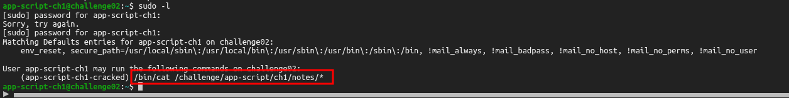
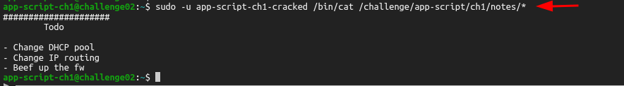
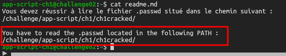
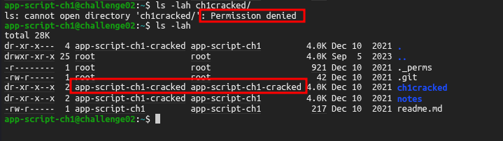
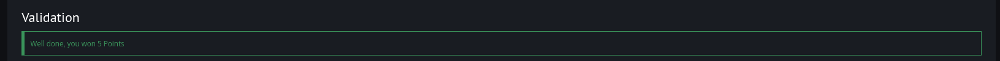

<p align="center">
  
</p>

---

- 🎯 **Target:** RootMe Challenge - Sudo Weak Configuration
- 🧑‍💻 **Author:** sonyahack1
- 📅 **Date:** 18.06.2025
- 📊 **Difficulty:** Easy
- 📁 **Category:** Privilege Escalation
- 💻 **Platform:** Linux


---


## Summary

| Stage         | Info                               |
|---------------|------------------------------------|
|     Flag     	| `flag{b3_c4r3ful_w1th_sud0}`       |
|  Credentials  | `app-script-ch1:app-script-ch1`    |
|   Technique   | `sudo wildcard escape`     	     |

---


## 🖧   connection to the system

> I connect to the system via web ssh:


> The vulnerability is in a weak and insecure **sudo** configuration

> I check which commands and which users are allowed to execute via **sudo** without having to enter a password:

```bash

app-script-ch1@challenge02:~$ sudo -l

```
> Result



> From the output I see the command `/bin/cat /challenge/app-script/ch1/notes/*` which is allowed to be used by the user
> `app-script-ch1-cracked` via **sudo** without entering a password.

> Using the command `cat` the contents of all text files from the directory `/notes` are displayed:

```bash

app-script-ch1@challenge02:~$ sudo -u app-script-ch1-cracked /bin/cat /challenge/app-script/ch1/notes/*

```
> Result:



> There is a `readme` file in the home directory with a small hint for this challenge:



> That is, there is a certain `.passwd` file in the user directory `app-script-ch1-cracked` whose information needs to be read



---

> Ok. I know that the user `app-script-ch1-cracked` has the right to use the `cat` command via **sudo** without having to enter a password. The problem is in the ending - `/*`.
> The point is that if `sudo` does not check the real, normalized path but simply compares the template as is, then this allows the hacker to go beyond the specified path to a higher level
> and execute the `cat` command in relation to other files that other users should not have access to in principle.

> To do this, I use the `sudo wildcard escape` technique. I go up a level, go to the directory with the `.passwd` file and try to display its contents on behalf of the user `app-script-ch1-cracked`
> via **sudo**:

```bash

app-script-ch1@challenge02:~$ sudo -u app-script-ch1-cracked /bin/cat /challenge/app-script/ch1/notes/../ch1cracked/.passwd

```
> Result:

```bash

b3_c4r3ful_w1th_sud0

```
> flag - `b3_c4r3ful_w1th_sud0`

## 🧠 Conclusion

> Path normalization is the process of converting a path to its canonical form (returns **absolute path**). It looks something like this:

```bash

your/path/to/../etc/shadow  →  /some/etc/shadow

```
> This can be done via the `realpath()` function or the `readlink` utility in Linux. If **sudo** compares the path as a string without checking (`realpath` for example)
> then there is a risk of `path traversal` vulnerability which will simply allow going beyond the allowed directory.

---

<p align="center">
  
</p>
